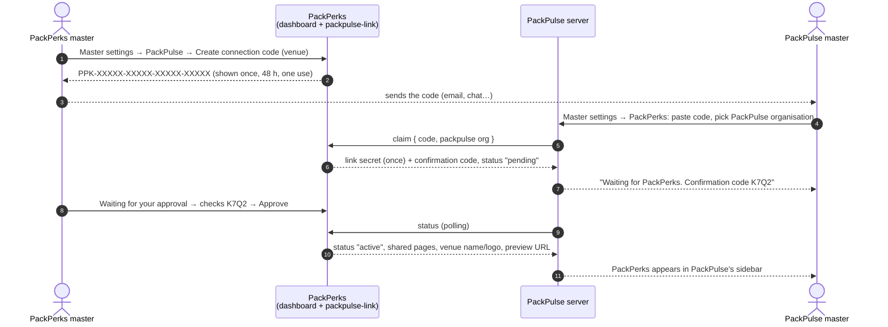
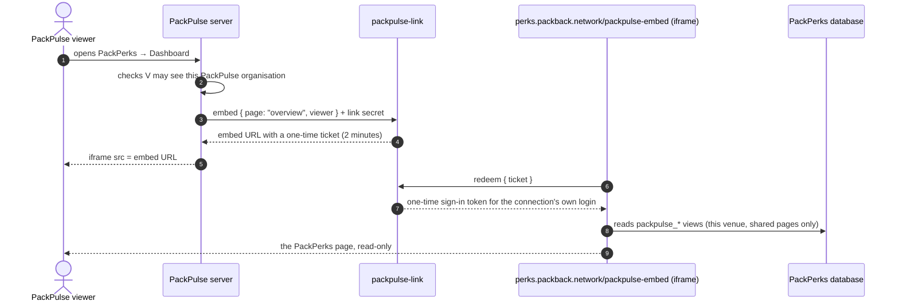

# PackPerks × PackPulse connection

A PackPulse organisation can show one PackPerks venue's **Dashboard**,
**System health** and **Reports & alerts** inside PackPulse, plus a
**Preview** button that opens the venue's customer app. PackPulse sees
these pages read-only, the way the venue's own vendors see them in the
PackPerks dashboard. The pages are PackPerks' own, rendered by PackPerks in
an iframe, so they look and behave exactly the same.

A PackBack master decides which venue is shared, with which PackPulse
organisation, and which pages. They can pause or end any connection at any
time, and access stops at once.

The PackPulse side is built by PackPulse's own Claude from
[`PACKPULSE_PROMPT.md`](PACKPULSE_PROMPT.md). Nothing in PackPulse's code or
database is touched from this repository.

---

## 1. Connecting a venue

1. **Code.** A master picks a venue in *Master settings → PackPulse → Set up
   a connection*, step 1, and creates a connection code. It is shown once,
   works once and expires after 48 hours. The code alone decides which venue
   is shared.
2. **Claim.** Someone at PackPulse pastes the code into *PackPulse → Master
   settings → PackPerks* and picks their PackPulse organisation. PackPulse's
   server sends it to PackPerks. PackPerks burns the code and answers with a
   **link secret** (PackPulse keeps it on its server; PackPerks stores only a
   hash) and a 4-character **confirmation code**.
3. **Approve.** The request shows up in step 3 of the same card, with the
   PackPulse organisation, who asked, from which PackPulse address, and the
   confirmation code. A master approves only when PackPulse shows the same
   code. That check catches a code that leaked and was used by someone else.
4. **Use.** PackPulse's sidebar gets a *PackPerks* category with the pages the
   master shares.

## 2. Viewing a page

- Every page view needs a **fresh embed URL** from PackPulse's server. The
  ticket in it works once, for two minutes, so a copied URL is worthless.
- The ticket lives in the URL's `#fragment`, so it never reaches a server log,
  and the embed page removes it from the address bar at once.
- The embed page trades the ticket for a session of the **connection's own
  login** (`link-<id>@packpulse.packperks.invalid`, one per connection). That
  session lives in the iframe's memory only.
- One iframe can stay open and switch pages by message (below), so PackPulse
  does not have to fetch a new URL on every sidebar click.

## 3. What PackPulse can and cannot see

The connection's login has **no dashboard profile**, so every ordinary
PackPerks table returns nothing to it. It can read only the `packpulse_*`
views (migration 057). Each view:

- returns rows of the connected venue only,
- only while the connection is **active** (not waiting, paused or ended),
- only while a page that needs the view is **switched on**,
- and leaves out what a partner should never hold.

| View | Needed by | Left out |
|---|---|---|
| `packpulse_users` | Dashboard, Reports | email (always empty), IBAN, device id, login id, consent fields |
| `packpulse_cup_balances` | Dashboard, Reports | — |
| `packpulse_claims` | Dashboard, System health, Reports | IBAN, receipt photos and AI texts, approval notes; the Tikkie link reads `hidden`; batch id hashed |
| `packpulse_cup_scans` | Dashboard, System health, Reports | photos; cup and batch ids hashed |
| `packpulse_activity_history` | Dashboard, Reports | — |
| `packpulse_cups` | System health | cup and batch ids hashed (an unclaimed cup id is a code that claims cups) |
| `packpulse_system_events` | System health | event details, who did it |
| `packpulse_client_events` | System health | every app event property except the scan id |
| `packpulse_pending_batches` | System health | email (always empty), marketing consent; batch id hashed |
| `packpulse_backup_cup_uses` | System health | amounts, device id |
| `packpulse_bin_sessions` | System health | machine and session ids, amounts |

Hashes are sha256, so the same id always gives the same hash: counts and joins
between views still work, but no code that claims cups can be read back.

The views are select-only for signed-in logins and closed to the public key.
Supabase's security advisor lists them as *Security Definer View*: that is
deliberate. They read the tables as their owner so the connection's login
never needs a policy on the tables themselves, which would expose every
column (emails, IBANs) to it.
Anything else the embed reads is already readable by any signed-in login
(organisation names, published app settings, locations).

**What the pages show.** The embed renders the pages the way a *vendor* sees
them: staff-only cards (Top returners, Reward budget) and the Customise menu
are hidden, PII exports are refused, and nothing can be changed. If the venue
has *Demo numbers for vendors* switched on, PackPulse sees the demo numbers
too, with a bar that says so. On Reports & alerts, the digest and alert email
settings are replaced by a short note: they are PackBack-wide settings with
PackBack's own recipients.

**Group venues.** A connection covers one venue. The *This store / group*
switch is not shown in the embed, and a group total is never shared.

## 4. Controls in PackPerks (Master settings → PackPulse)

Two cards, in the order the job is done.

**Set up a connection** walks the three steps and holds the control for each:

- **Step 1 — create a code**: pick a venue, create the code, copy it. Unused
  codes are listed underneath with their last four characters, and can be
  cancelled.
- **Step 2 — send it to PackPulse**: where they paste it.
- **Step 3 — approve the request**: approve or decline, with the confirmation
  code to compare. It says *Nothing waiting for approval* when it is quiet.

**Connections** is the live state:

- **The diagram**: PackPerks venues on the left, PackPulse organisations on
  the right. A solid line is connected, dashed is waiting for approval or
  paused, and the chip riding each line says how many of the four pages that
  connection shares and how often it was opened in the last 7 days.
- **One row per connection**: switch pages on or off (Dashboard,
  System health, Reports & alerts, Preview). A page switched off disappears
  from PackPulse's sidebar on its next status check, and its data stops at
  once. **Pause** keeps the connection but shows nothing until *Resume*.
  **Disconnect** ends it and deletes the connection's login. Each
  connection shows when it was last opened, views in the last 7 days and its
  recent activity (who opened which page).
- Everything a master does here goes to the audit log (`packpulse.*`), and
  every step of a connection is kept in `packpulse_link_events`.

PackPulse can also end a connection from its side (`disconnect`); it then
shows as *Disconnected by PackPulse*.

## 5. The contract (for developers)

**Endpoint** `POST https://ozvcpbthnauitaphosfb.supabase.co/functions/v1/packpulse-link`
(JSON body with `action`). Only PackPulse's **server** calls it with a
secret, in the header `x-packpulse-secret: ppl_…`. The edge function runs
with `verify_jwt` off because it checks the secret or ticket itself.

| Action | Auth | Body | Answer |
|---|---|---|---|
| `claim` | none (the code) | `{ code, packpulse: { org_id, org_name, app_origin?, requested_by?: { email?, name? } } }` | `{ link_id, secret, status: "pending", confirm_code, packperks: Venue }` |
| `status` | secret | `{}` | `{ link_id, status, confirm_code?, pages, packperks: Venue, packpulse, preview_url, approved_at, ended_at, ended_by }` |
| `embed` | secret | `{ page: "overview"\|"stats"\|"reports", theme?: "light"\|"dark", parent_origin?, viewer?: { email?, name? } }` | `{ url, expires_at }` |
| `disconnect` | secret | `{}` | `{ ok: true, status: "revoked" }` |
| `redeem` | the ticket | `{ ticket }` (called by the embed page itself) | `{ token_hash, page, pages, link_id, org_id, … }` |

`Venue` is `{ org_id, name, brand_name, slug, country, brand_color, logo_url,
mode, mode_label, app_url, archived }`. `pages` is
`{ overview, stats, reports, preview }`, all `false` unless the status is
`active`. `status` is one of `pending`, `active`, `paused`, `declined`,
`revoked`.

Errors are `{ error: code }` with an HTTP status: `invalid_code` (400/404),
`code_expired` (410), `already_connected` (409), `missing_packpulse_org`
(400), `unknown_link` (401: wrong or deleted secret), `not_active` (403, with
`status`), `page_off` (403), `bad_page` (400), `ticket_expired` (410),
`rate_limited` (429), `login_failed`/`db_error`/`server_error` (500).

Rate limits: claim 20 an hour per IP; embed 600 an hour per connection;
redeem 240 an hour per IP.

**Embed URL** `https://perks.packback.network/packpulse-embed#t=<ticket>&p=<page>&theme=<light|dark>&o=<parent origin>`

**Messages** (`window.postMessage`, both sides check the origin):

| Direction | Message |
|---|---|
| embed → PackPulse | `{ source: "packperks", type: "ready", page, pages, venue }` |
| | `{ source: "packperks", type: "page", page }` after it changed page |
| | `{ source: "packperks", type: "size", height }` whenever its height changes |
| | `{ source: "packperks", type: "session_ended", reason: "expired"\|"paused"\|"ended"\|"page_off" }` |
| PackPulse → embed | `{ source: "packpulse", type: "navigate", page }` |
| | `{ source: "packpulse", type: "theme", theme: "light"\|"dark" }` |

The embed sends messages only to the origin in the URL (`o`), which PackPerks
checked when it made the URL, and accepts messages only from that origin.

**Framing.** `vercel.json` allows `/packpulse-embed` inside frames from
`https://pack-pulse-v1-5.vercel.app`, `https://*.packback.network` and
`http://localhost:*` (development). A new PackPulse address must be added
there, or browsers refuse to show the frame.

## 6. Where it lives

| | |
|---|---|
| `supabase/migrations/057_packpulse_links.sql` | tables, `packpulse_org_ids()`, the views, master functions |
| `supabase/migrations/058_packpulse_status_after_end.sql` | an ended connection still answers `status` |
| `supabase/migrations/059_packpulse_pending_email_column.sql` | `packpulse_pending_batches` keeps an empty `email` column that System health asks for |
| `supabase/functions/packpulse-link/` | claim, status, embed, redeem, disconnect |
| `src/admin/master/PackPulsePanel.jsx` | Master settings → PackPulse |
| `src/admin/embed/PackPulseEmbed.jsx` | `/packpulse-embed` |
| `src/lib/supabase.js` | embed mode: memory-only session, tables → `packpulse_*` views |
| `vercel.json` | who may frame the embed |

## 7. When you change PackPerks

- **A page reads a new table.** Add a `packpulse_*` view for it (only the
  columns the page needs, filtered by `packpulse_org_ids(array[pages])`), add
  it to `PACKPULSE_VIEWS` in `src/lib/supabase.js`, and revoke/grant like the
  others. Without that the embed silently shows zeros for it.
- **Never give the connection login a dashboard profile** (`admin_profiles`):
  org isolation is not enforced in the database for dashboard accounts, so
  it would read every venue. Its email domain, `packpulse.packperks.invalid`,
  is neither invitable in practice nor on the trusted `@packback.network`
  list, so `bootstrap-admin` refuses it (tested).
- **Sharing another page.** Add it to `EMBED_PAGES` in the edge function and
  the embed, a switch in the panel, and to `packpulse_admin_update`'s page
  list.

## 8. Troubleshooting

| What happens | Why |
|---|---|
| PackPulse gets `invalid_code` | typo, already used, or cancelled. Create a new one. |
| `code_expired` | older than 48 hours. Create a new one. |
| `already_connected` | that venue is already connected (or waiting) to that PackPulse organisation. |
| The iframe says *This view has expired* | the ticket was used or is older than 2 minutes. PackPulse should fetch a new URL on `session_ended`. |
| The frame stays blank in the browser | PackPulse runs on an address not allowed in `vercel.json`. |
| Numbers are zero in PackPulse but not in PackPerks | a page reads a table without a `packpulse_*` view (see 7), or the page that needs it is switched off. |
