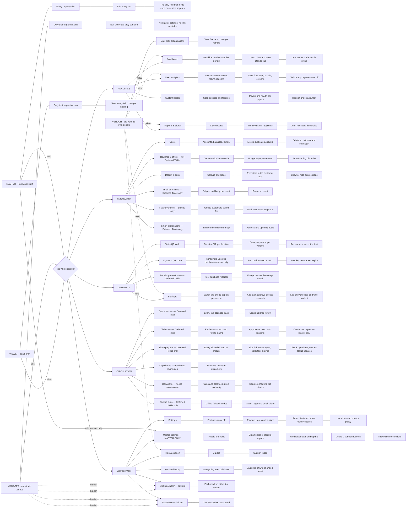

# Who can reach what — roles × dashboard tabs

Source of truth: `src/admin/lib/access.js` (`LEVELS`, `BUILT_IN_ROLES`, `TABS`,
`TAB_GROUPS`). Regenerate this chart from there when a tab is added.

**The four built-in roles.** Three levels; the manager level ships two roles.

| Role | Level | Organisations | Tabs |
|---|---|---|---|
| Master | master | every one | every tab, edit, plus Master settings |
| Manager | manager | the ones on their account (`org_ids`, or all with `all_orgs`) | every tab, edit — except Master settings, MockupMaster and PackPulse |
| Viewer | manager | the ones on their account | every tab, **view only** — except Master settings |
| Vendor | vendor | the ones on their account | Dashboard, User analytics, Reports & alerts, Help & support, Staff app — view only |

Two rules cut across the table:

- **Money is master-only.** Minting cups and creating payouts are refused for
  anyone below master, whatever their tab access says (`hasPermission()`, and
  the edge functions check it again).
- **The database is not the boundary.** Which tab a role may change, and which
  venues it sees, is enforced by the dashboard. See *Org isolation* in
  CLAUDE.md.

A tab can also be hidden for reasons that have nothing to do with the role:
the venue's programme mode, a feature switched off in Settings, or a master
switching it off for the whole workspace (`workspace:tabs`).
`tabAvailability()` is the one place that decides.

---

## Paste this into FigJam

FigJam turns Mermaid into a diagram: **paste the block below onto the canvas**
(or use the diagram/Mermaid input). Colours are not carried over — select the
role nodes afterwards and colour them there.

### If the chart is too wide for one FigJam board

Paste the roles half on its own first — everything from `flowchart TD` down to
the vendor's dashed arrows — then paste each group's block beside it. The node
names match, so the two halves read as one map.
